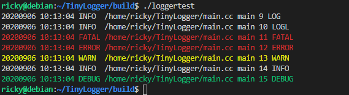

# TingLogger
A C++ Asynchronous Logging library


## How to use

Just inculde the hear file and source file in your project

## example

```cpp
#include "Logger.h"
using namespace std;
using namespace log;

int main() {
    Logger::Init(true, false);
    Logger::SetColor(true);

    LOG() << "LOG";
    LOGL(LogLevel::INFO) << "LOGL";
    FATAL() << "FATAL";
    ERROR() << "ERROR";
    WARN() << "WARN";
    INFO() << "INFO";
    DEBUG() << "DEBUG";

    Logger::Stop();

    return 0;
}
```



